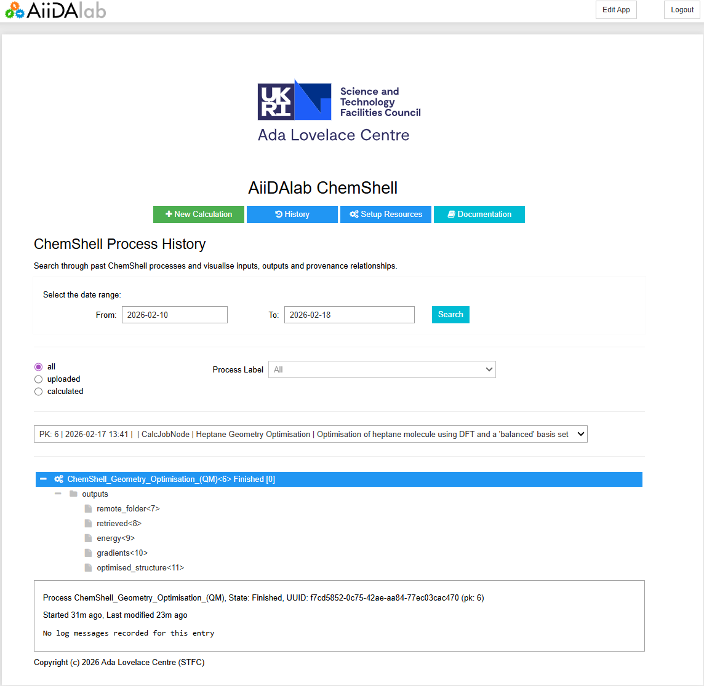
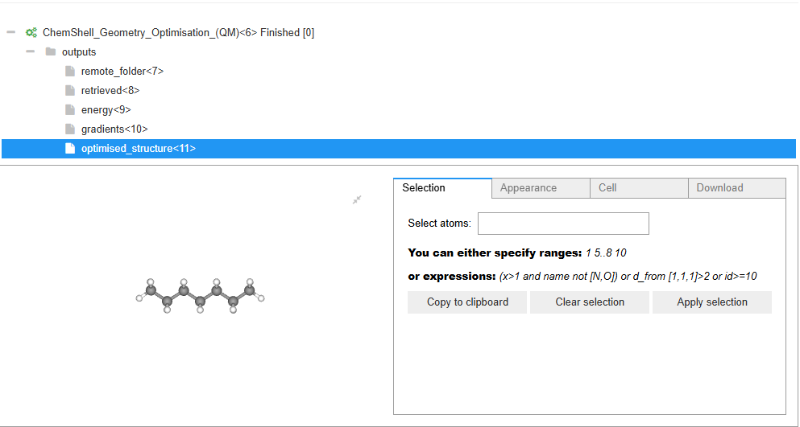
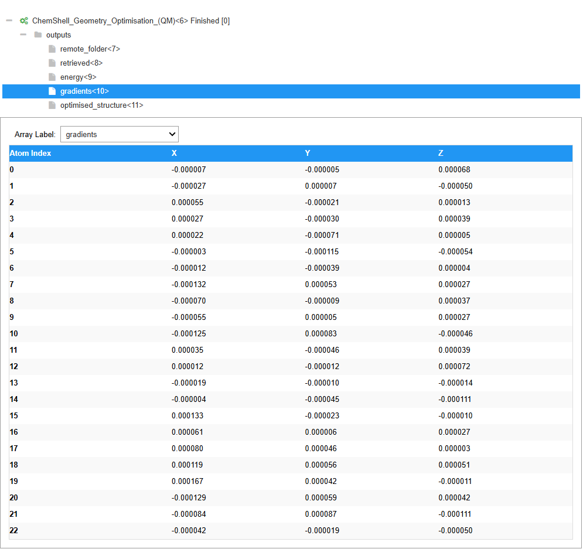
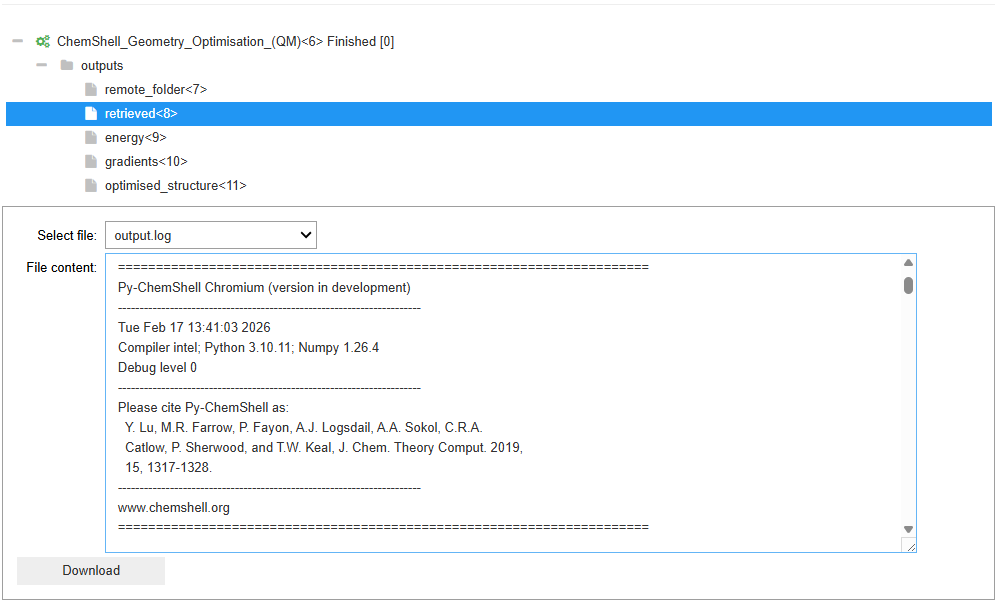
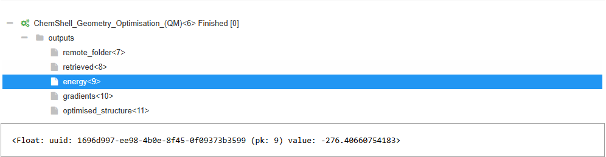

.. _history_page:

Calculation History
===================

This page allows users to search through previously submitted processes and displays
key information such as AiiDA database references and the calculation results. The
first half of the display contains a database search UI component which enables more
tailored searches which is useful if the database is significantly large. By default
it will simply search for all items in the database with the process key (i.e. all
previously submitted workflow processes) which will include any processes submitted
by the user not just those submitted through the AiiDAlab ChemShell interface. 

Once a process has been selected it becomes visible in the tree view in the second half
of the display. This visualiser mirrors that of the results view when the workflow was
originally submitted via the main ChemShell UI. The main process displays its state and
can be expanded to show a list of associated results objects for the job. Each of these
object can then be selected and will be shown in the visualiser at the bottom of the page. 
This will either show a dedicated visualiser for the results object or if one is not 
available it will show the AiiDA database reference for the object. Example for different
supported visualisers are show below. 

Structure Visualiser
~~~~~~~~~~~~~~~~~~~~

One of the core abilities of the AiiDAlab ChemShell UI is to visualise chemical structures.
This is the same visualiser as used in the structure input step but here it is used to
visualise calculation results such as the optimised geometry of the given structure.

Array Visualiser
~~~~~~~~~~~~~~~~

Certain job types in ChemShell return an array of values, such as the forces on each
atom after a single point calculation or geometry optimisation. These can be visualised
in a table as shown here, 

Folder/File Visualiser
~~~~~~~~~~~~~~~~~~~~~~

By default AiiDA produces a dictionary style folder object which contains all the files
that were returned as part of the AiiDA (ChemShell) process. All the items within this 
folder can be viewed as files and can be switched between using the drop down menu provided.
As part of the retrieved objects dictionary that AiiDA returns for any ChemShell process
the main ChemShell output log is included (*output.log*) and can be viewed directly
in the UI.

Single Value/AiiDA Node Viewer
~~~~~~~~~~~~~~~~~~~~~~~~~~~~~~

Any value that is simply a single value (integer/floating point) or a type that doesn't have
a dedicated visualiser is viewer as an AiiDA data noe. This includes the *type*, *uuid*, 
*node pk* and the value if it is a simple data value. The example shown is for a single floating
point number that corresponds to the final energy of the system that has been optimised. 

.. note:: Energies outputted by ChemShell are typically in **atomic units** (Hartree). Common conversions 
    are:

    - 1 Hartree
    - 27.211386 eV
    - 2625.50 kJ/mol
    - 627.509 kcal/mol
    - 2.194746 wavenumbers
    - 4.359745x10-18 Joules