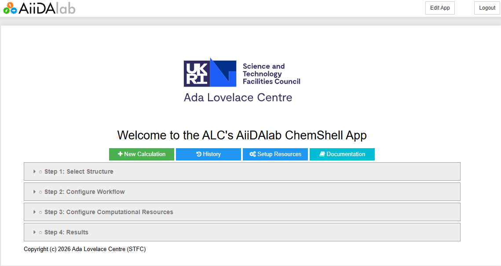
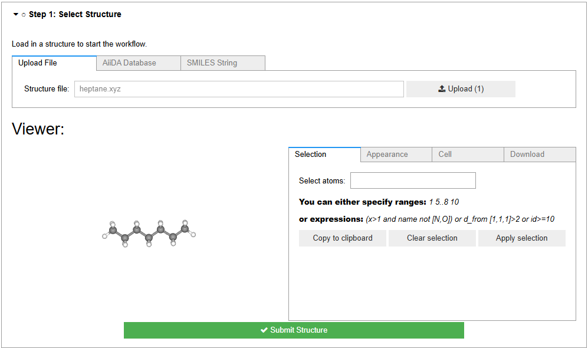
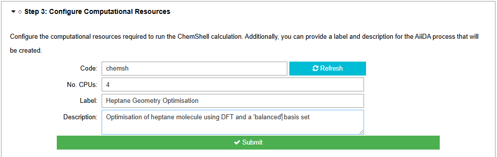
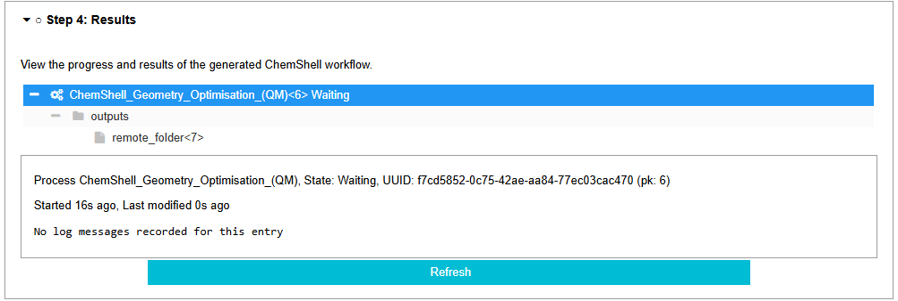
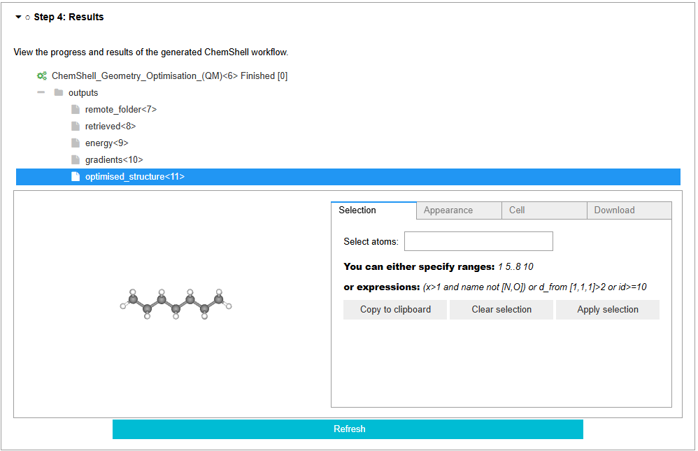

.. _workflows:

ChemShell Workflow Configuration
================================

This is the main page for the AiiDAlab ChemShell plugin and allows users to configure
and submit ChemShell based computational calculations and view a summary of key results.
The page consists of a header with the same navigational components as the start banner
and a wizard style configuration menu enabling step-by-step configuration of complex
computational workflows which will utilise ChemShell's multiscale modelling capabilities.

Configuration Wizard
--------------------

The primary component of this page is the configuration wizard which itself is broken 
down into several steps each of which is required to submit the complete workflow. 
Each step contains input fields which the user can interact with to configure the
workflow alongside a **submit** button which will *lock-in* the user's choices submitting
them to the underlying AiiDA engine which will communicate and manage the ChemShell
process.

Structure Input 
~~~~~~~~~~~~~~~

This is the first step and often the foundation of any workflow based on chemical
modelling. It provides several options for uploading a chemical structure to the
workflow as different tabs within the UI. The currently supported options are;
uploading a structure file (i.e. a .xyz chemical structure file), SMILES string
input (generate a generic 3D structure from a SMILES string) and a database
search option which enables the inclusion of structures already present in the
AiiDA database either from previous calculations, other plugins or that have
been included via the AiiDA command line interface (CLI). 

These input tabs are then followed by a visualisation box which allows the user
to dynamically visualise the structure they have uploaded (if it is in a supported
format). This box includes different visualisation options including options such
as whether to render the structure as *ball-and-stick*, *vdw* or *stick* representations
for example. It also exposes editing features, however, these are not fully 
supported by the AiiDAlab interface. Therefore, whilst users can use the editing 
features, to include the updated structure within the workflow configuration the
user will need to save the updated structure as a new structure file and upload this
new structure file via the *Upload Structure* tab.

Whilst the physical creation/drawing of chemical structures is not directly supported
within the AiiDAlab ChemShell UI, there are many online applications which allow the
drawing of chemical structures and outputting them to *.xyz* files (or as a SMILES string)
which can then be imported into the workflow via the *Upload Structure* tab. Examples 
include:

- list
- of 
- exmples

Workflow Setup
~~~~~~~~~~~~~~

This is the core step in configuring the different available workflows within the
AiiDAlab ChemShell plugin. It provides different tabs for each of the available 
workflows (see :ref:`available_workflows`) each providing a tailored UI with various
input fields for the different components of the workflow setup. Typically these 
will be pre-filled with sensible default values to quickly setup a reasonable
configuration for the given workflow but can then be altered by the user to 
further tailor the workflow to suite their specific needs. 

Resource Setup
~~~~~~~~~~~~~~

This step enables the user to define where and how the underlying ChemShell
software will run. The core inputs are the *AiiDA code instance* which tells
the AiiDA engine where the ChemShell executable exists and how to communicate
with it (more information on AiiDA code instances is given in 
:ref:`resource_management`), and the number of CPU cores to provide for the
ChemShell calculation. 

In addition to these inputs it also provides inputs for a *label* and 
*description* field which will be associated with the created AiiDA process
for improved future reference, see :ref:`history_page` for more information
on how these values are useful. 

Job Monitor & Results
~~~~~~~~~~~~~~~~~~~~~

The final step for the wizard is a combined job monitor and results viewer. This
UI component is only available once all previous stages have been completed and a 
workflow has been successfully submitted. Once submitted it will appear in the 
UI with a key depicting what its status is; *created*, *finished, *excepted* etc.
Initially processes are given the *created* status which means they have successfully
been submitted to the AiiDA engine and are being carried out in the background. 
Once finished they will typically be given one of two status keys, if the process 
finished normally it will be labelled as *finished*. If if has failed for any reason
it will generally be given the *excepted* key.

Once a process has finished its associated results objects will be listed in the 
displayed access tree under *outputs*. This may require a *refresh* to be properly
updated which can be carried out via the *refresh* button at the bottom of the UI.
Each of the listed results can then be clicked on and visualised in the display 
either as references to their AiiDA database object or as a more detailed viewer 
if one is supported for the data type. 

.. note:: Energies outputted by ChemShell are typically in **atomic units** (Hartree). Common conversions 
    are:

    - 1 Hartree
    - 27.211386 eV
    - 2625.50 kJ/mol
    - 627.509 kcal/mol
    - 2.194746 wavenumbers
    - 4.359745x10-18 Joules

.. _available_workflows:

Available Workflow Configurations
---------------------------------

Geometry Optimisation
~~~~~~~~~~~~~~~~~~~~~